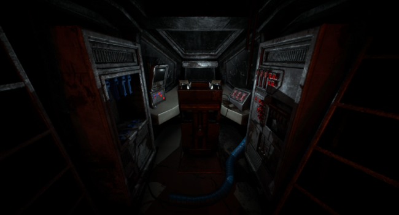

# Space_Crash

## Quick presentation
1 Month project for the 2nd year of my studies at Isart Digital in Association with 3rd Year Game designer. The goal was to create a game using the Unreal Engine in VR. The theme was "Space". We decided to create a game where you have to solve Puzzle while trying to survive a dangerous Alien that roam free in your space ship. 

## Installation

- open the project with Unreal Engine 5.0.2

## Features

- 5 different puzzle
- an alien that roam free in the ship using semi-complete AI
- Full VR support
    

## Authors

- [@Angel](https://github.com/Angel-2180)